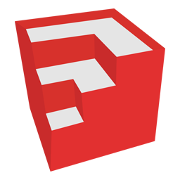

# About me

## Work and academic life
- 🎓 &nbsp; Graduated in **Electrical Engineering** from [Universidade Positivo](https://www.up.edu.br/)
- 💼 &nbsp; Working as **Full-Stack Developer** at [Alexandria](https://alexandria.solar/)

## GitHub status

  
  

## WakaTime status

## Contact

&nbsp;

&nbsp;

&nbsp;

&nbsp;

 

---

# Skills
## Languages, Frameworks and others

  
  
  
  
  
  
  
  
  
  
  
  
  
  
  
  
  
  
  
  
  
  
  
  
  
  
  

## Tools

  
  
  
  
  
  
  
  
  
  
  
  
  
  
  
  
  
  
  

## Databases

  
  
  
  
  

## ORMs / ODMs

  
  
  

## DevOps

  
  
  
  
  

## Linters / Formatters

  
  
  
  
  
  
  

## Prototype boards

  
  
  
  
  

 

---
# Already leaving?

  

  &nbsp;&nbsp; ***Check out my [repositories](https://github.com/Marco-Veio?tab=repositories) first!***

